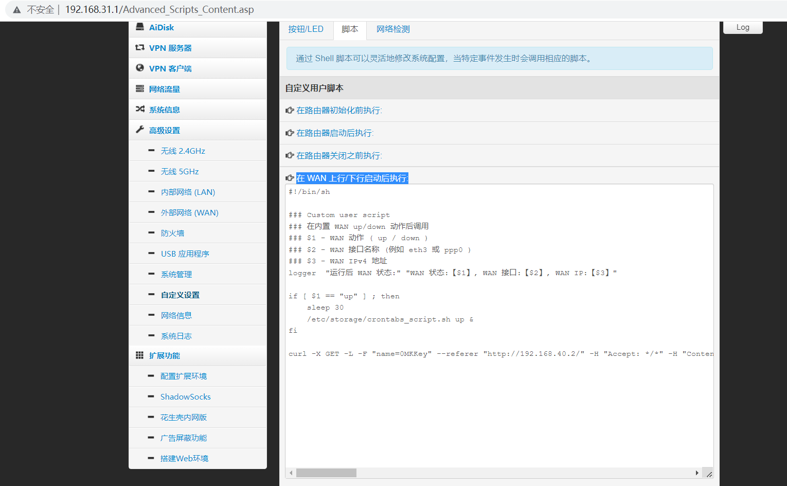

# connect_jxyy_network
自动连接 江西应用技术职业学院 寝室的 校园网

目前在20栋的 dr.com 的登录系统中测试通过

目前最新的是Go语言版本，使用前请复制`config_example.yaml`到可执行文件目录下的`config.yaml`，然后根据提示填进去就可以了

## 快速开始
### 使用Go 语言的程序

1. 去 [Releases](https://github.com/wochaoop/connect_jxyy_network/releases) 下载对应架构的压缩包
2. 解压这个文件
3. 切换到与配置文件相同的目录
4. 创建并编辑`config.yaml`配置文件
```yaml
# 以下是配置信息

# 账号，默认是学号
account: ''
# 密码，默认是身份证后六位
password: ''
# 账号运营商，电信 telecom，移动 cmcc，联通 unicom
operator: 'telecom'

# 上面的配置是主要的

# 回调
callback: 'dr1003'
# 登录方法
login_method: '1'
# WAN IPV4 地址，可以不指定
ipv4: ''
# WAN IPV6 地址，可以不指定
ipv6: ''
# MAC 地址
mac: '000000000000'
# 登录入口 ip
inlet_ip: '192.168.40.2'
# User-Agent, 一般不用改
ua: 'Mozilla/5.0 (Windows NT 10.0; Win64; x64) AppleWebKit/537.36 (KHTML, like Gecko) Chrome/106.0.0.0 Safari/537.36'
# 最大尝试次数
max_attempts: 12
# 尝试延迟时间(秒)
attempt_delay: 5
# 是否只执行一次，即不要死循环
only_once: false
```
5. 直接运行可执行文件

### 使用其它的程序
那个`bat`脚本编辑一下配置就可以在 Windows 系统用了，没有做自动检测，但可以利用计划任务实现自动联网

`sh`脚本用在 Linux 系统上 ~~（废话）~~ ,结合 crontab 就可以实现全自动联网，解放双手

理论上 dr.com 的网关系统都可以，这个脚本使用的是 GET 方法提交 ~~(POST方法应该也行？但我试了无效，也许别的学校可以？)~~

其实还可以写成 python 脚本的，但毕竟我是塞 OpenWrt 系统里用的，我的 Redmi AC2100 路由器是 mips32 的架构，本身才 128M 内存， python 本身只能阉割版的，我懒得弄了

还是 shell 脚本比较通用

## 截图
- 测速


- Pandavan

- OpenWrt
- - 记得配置一下防火墙 ~~（要不然被连上路由器的贱人给断网了）~~
  
  
  


## 参考文献：

- [Dr.COM校园网多设备解决方案——路由器 Padavan/LuCI 固件自动网页认证+Telegram Bot 定时发送连接情况 - 老虎豆](https://tiger.fail/archives/drcom-autologin-padavan-tgbot.html)
- [drcoms/drcom-generic: Dr.COM/DrCOM 现已覆盖 d p x三版。](https://github.com/drcoms/drcom-generic)
- [教你如何在Drcom下使用路由器上校园网(以广东工业大学、极路由1S HC5661A为例) - 云外孤鸟 - 博客园](https://www.cnblogs.com/cloudbird/p/10406936.html)
- (https://www.right.com.cn/forum/thread-215978-1-1.html)
- https://zhuanlan.zhihu.com/p/63085260
- https://gist.github.com/binsee/4dfddb6b1be2803396250b7772056f1c
- http://www.manongjc.com/detail/25-tfxssayypwvtqzm.html
- https://th0masxu.com/index.php/archives/322
